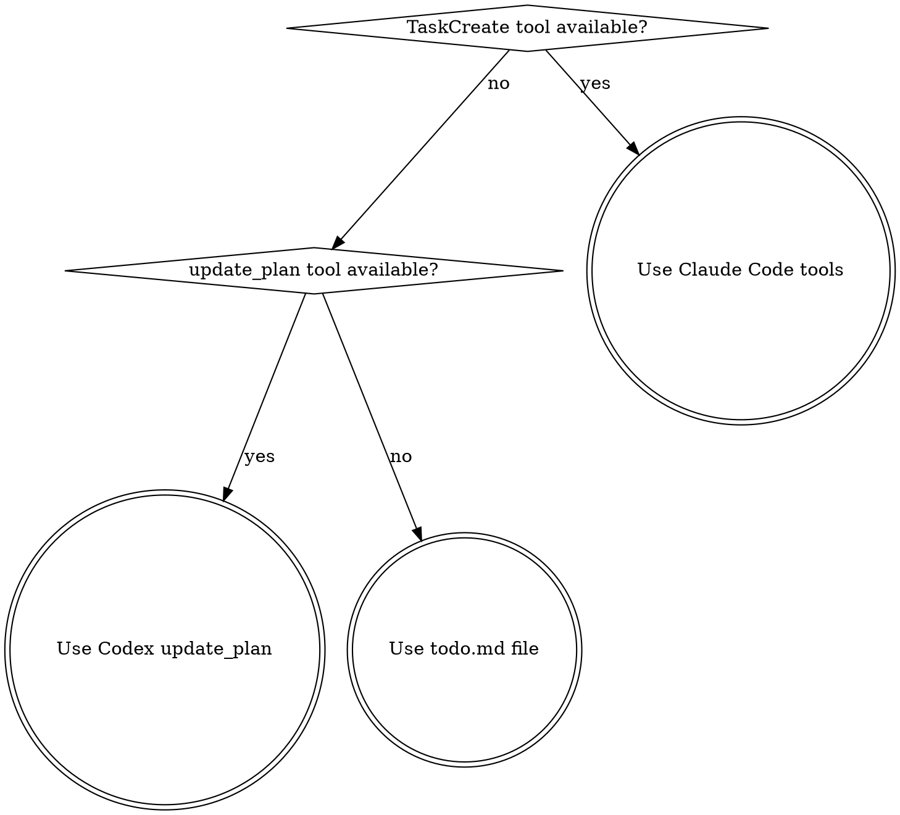

# Mapping Task Tools

## Overview

Map task tracking operations to the right tool for your platform. Skills reference "TaskCreate" or "TodoWrite" generically - this skill tells you what to actually call.

**Core principle:** Same workflow, different tool calls per platform.

## When NOT to Use

- Single task with no tracking needed
- Already familiar with your platform's native task tools

## Platform Detection



## Quick Reference

| Operation | Claude Code | Codex | Gemini CLI |
|-----------|-------------|-------|------------|
| Create tasks | `TaskCreate` per item | `update_plan` with full plan array | `todo.md` file (use reciting-task-state) |
| Start task | `TaskUpdate` status=in_progress | `update_plan` set step to in_progress | `todo.md` file (use reciting-task-state) |
| Complete task | `TaskUpdate` status=completed | `update_plan` set step to completed | `todo.md` file (use reciting-task-state) |
| List tasks | `TaskList` | (state lives in update_plan) | `todo.md` file (use reciting-task-state) |
| Get task detail | `TaskGet` by id | (steps are strings, no detail) | `todo.md` file (use reciting-task-state) |

## Codex

Single `update_plan` tool replaces the entire plan each call. Always send the full array.

**Constraints:**
- At most one step can be `in_progress` at a time
- Valid statuses: `pending`, `in_progress`, `completed`
- No task IDs - identify steps by their `step` string

```json
{
  "explanation": "Starting task 1 of 3",
  "plan": [
    {"status": "in_progress", "step": "Implement auth module"},
    {"status": "pending", "step": "Add unit tests"},
    {"status": "pending", "step": "Update API docs"}
  ]
}
```

To mark a task complete and start the next:

```json
{
  "explanation": "Auth complete, starting tests",
  "plan": [
    {"status": "completed", "step": "Implement auth module"},
    {"status": "in_progress", "step": "Add unit tests"},
    {"status": "pending", "step": "Update API docs"}
  ]
}
```

## Gemini CLI

No native task tool. Use a `todo.md` file to maintain task state across turns.

**REQUIRED SUB-SKILL:** Use reciting-task-state for the full technique, format, and rules.

## Common Mistakes

- **Codex: Sending only changed steps.** `update_plan` replaces the entire plan. Always include all steps with current statuses.
- **Codex: Sending partial plan arrays.** Never send a subset of steps; include every existing step on each call.
- **Codex: Mutating step schema.** Do not change step names, add/remove steps, or reorder steps; only status transitions are allowed.
- **Codex: Multiple in_progress steps.** Only one step can be in_progress at a time.
- **All platforms: Skipping task tracking.** If a skill says to track tasks, track them. The tool differs, the discipline doesn't.
