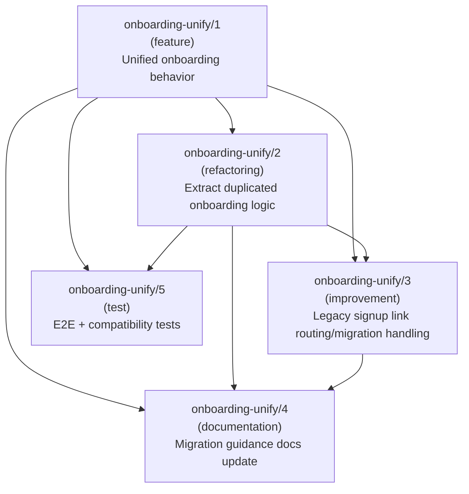

# Ticketing

Convert ambiguous user requests into approved tickets with specs.

## Core Principles

- Ask one question at a time{{tool.ask_user}} — multi-part questions overwhelm users and produce vague answers.
- Keep questions decision-focused and noise-free — irrelevant details slow the process without improving ticket quality.
- Track every phase using {{tool.task_tracking}} — visible progress prevents phase skipping and keeps both sides aligned.
- Do not claim readiness until blocking unknowns are resolved — premature approval leads to rework during implementation.

## Quick Reference

1. Apply splitting criteria to decompose the request into single-intent tickets.
2. Assign set-based IDs and determine dependency order.
3. Author a quality-attribute-governed Spec for each ticket.
4. Resolve blocking unknowns with targeted interview and codebase exploration.
5. Run readiness gate (including spec quality) and request approval.
6. Save the approved ticket artifact to `docs/tickets/`.

## When to Use

- The request is broad, mixed, or ambiguous.
- The request must be split into multiple sequential tickets.
- Scope and acceptance criteria must be explicit before implementation.
- The user wants a ticket artifact before implementation.

## When Not to Use

- The request is already concrete and implementation-ready.
- The change is trivial and does not need ticket decomposition.
- The user asks for direct implementation without specs.

## Input / Output Contract

- Input: a user request that needs decomposition and requirement concretization.
- Ticket Output: `docs/tickets/YYYY-MM-DD-<topic>-ticket.md`
- Topic token rule: `<topic>` must be `kebab-case`.
- Ticket IDs in a ticket file: `<topic>/1`, `<topic>/2`, `<topic>/3`, ... where set name equals the topic token.

## Ticket Type

Assign exactly one type per ticket based on primary intent.

| Type | Assign When |
|------|-------------|
| `Feature` | Adding new capability or changing existing functional behavior |
| `Refactoring` | Restructuring code without changing observable behavior |
| `Documentation` | Creating or updating human-readable documentation |
| `Test` | Adding or expanding test coverage |
| `Bug` | Correcting behavior that deviates from documented or expected behavior |
| `Improvement` | Enhancing non-functional aspects of existing capability (performance, UX, maintainability) |

If intent spans multiple types, split into separate tickets per splitting criteria.

## Process

Use {{tool.task_tracking}} for each phase and step status update — this makes progress visible and prevents accidentally skipping phases.

### Phase 1: Decompose Request into Incomplete Tickets

**Goal:** Break the user request into the smallest set of single-intent tickets. Each ticket has only type, goal, and dependencies — full specs are deferred to Phase 3.

**Steps:**

1. **Derive the topic token.** Extract the central theme as a 2-3 word kebab-case slug (domain noun + action/quality). This becomes the set name and file name fragment.
   - Example: "search API performance" → `search-performance`
2. **Identify intents and assign types.** Parse the request for distinct intents. Map each to exactly one ticket type. If a sentence spans multiple types, split it.
3. **Establish dependencies.** For each ticket, determine which other tickets must complete before it can start. List only direct `depends-on` entries. The resulting graph must be a DAG (no cycles).
4. **Order by dependency and assign IDs.** Topologically sort the tickets so no ticket depends on a higher-numbered one. Number sequentially: `<topic>/1`, `<topic>/2`, ...
5. **Apply splitting criteria.** Validate every ticket against the splitting criteria below. Split or merge if any criterion fails.
6. **Present the incomplete ticket list to the user{{tool.ask_user}}:** topic token, each ticket (ID, type, goal, depends-on), and dependency graph (Mermaid `graph TD`). Ask for confirmation before proceeding.

#### Splitting Criteria

A Ticket can remain as a single unit only if **ALL THREE** conditions hold. These criteria ensure each ticket can be independently implemented, verified, and debugged.

- **Single Intent** — one ticket type, one goal; describable as "this ticket does X".
- **Immediately Verifiable** — a validation method exists at completion time.
- **Failure Cause Identifiable** — failure is traceable within this ticket alone.

If any criterion fails, split or merge.

**Single-ticket case:** If decomposition yields only one ticket, skip the dependency graph in the presentation. Still proceed to Phase 2 to check for missing work items.

#### Example

**User Request:** "Our web and mobile onboarding flows are functionally similar but implemented separately, which is expensive to maintain. I want users to see one consistent experience, while keeping existing legacy signup links working. Include migration guidance, documentation updates, and test automation scope in the decomposition."

**Incomplete Tickets:**
- `onboarding-unify/1`:
  - type: feature
  - goal: "Define and implement a unified onboarding behavior across web and mobile."
- `onboarding-unify/2`:
  - type: refactoring
  - goal: "Extract duplicated onboarding logic into shared components/services."
  - depends-on: `onboarding-unify/1`
- `onboarding-unify/3`:
  - type: improvement
  - goal: "Add backward-compatible routing and migration handling for legacy signup links."
  - depends-on: `onboarding-unify/1`, `onboarding-unify/2`
- `onboarding-unify/4`:
  - type: documentation
  - goal: "Update product and engineering docs with migration guidance."
  - depends-on: `onboarding-unify/1`, `onboarding-unify/2`, `onboarding-unify/3`
- `onboarding-unify/5`:
  - type: test
  - goal: "Add end-to-end and compatibility tests for legacy and unified onboarding paths."
  - depends-on: `onboarding-unify/1`, `onboarding-unify/2`

**Dependency Graph:**

**Transition:** User confirms the ticket list → proceed to Phase 2.

### Phase 2: Identify Missing Tickets

**Goal:** Review the decomposed ticket set for implicit or overlooked work items that the user did not explicitly request but are necessary for a complete, deliverable outcome.

**Steps:**

1. **Scan for gaps.** Compare the ticket set against the original request and the codebase context. Look for work items that are implied but not captured — such as missing test coverage for new behavior, documentation for changed interfaces, migration paths for breaking changes, or cleanup of obsoleted code.
2. **Draft missing tickets.** For each gap found, prepare a candidate ticket with type, goal, and depends-on — same format as Phase 1 output.
3. **Present gaps to the user{{tool.ask_user}}.** Show the candidate tickets and ask for approval to add them to the set. If no gaps are found, state that explicitly and ask for confirmation to proceed.
4. **Update the ticket list.** Integrate approved tickets, reassign IDs to maintain dependency order, and re-validate splitting criteria.

**Transition:** User confirms gap analysis (added or no gaps) → proceed to Phase 3.

### Phase 3: Author Ticket Specs

**Goal:** For each incomplete ticket, interview the user to populate all Spec fields. Continue interviewing until every field meets its quality attributes and all blocking unknowns are resolved.

**Steps:**

1. **Select the next ticket.** Process tickets in dependency order (lowest ID first). Mark the current ticket as in-progress via {{tool.task_tracking}}.
2. **Explore the codebase.** Search for files, modules, and functions relevant to the ticket's goal. Narrow down to 2-5 concrete file paths that will populate the In-Scope list. Stop exploring once you can name the specific locations to change. If no existing codebase exists, derive In-Scope items from the planned architecture or user description instead of file paths.
3. **Draft the Spec.** Fill in each field using codebase findings and the original request. Use placeholder markers for fields that require user input.
4. **Interview for each incomplete field{{tool.ask_user}}.** Ask one targeted, decision-focused question per turn until every field meets its quality attributes. Follow the field order below.

#### Interview Example

**Ticket:** `search-performance/1` (Feature)
**Incomplete field:** Acceptance Criteria

> "What should happen when a search query returns zero results — should the API return an empty array, a 404 status, or a specific error message?"

5. **Validate quality attributes.** After user answers, verify the field against its quality attributes. If it fails, ask a follow-up question to sharpen the answer.
6. **Classify open questions.** Mark each unresolved item as `Blocking` or `Non-blocking`. Any `Blocking` item must be resolved before moving to the next ticket.
7. **Present completed Spec for confirmation{{tool.ask_user}}.** Show the full Spec to the user. Proceed to the next ticket only after confirmation. If the user requests changes, return to Step 4.
8. **Repeat for all tickets.** Return to Step 1 for the next ticket.

#### Spec Fields Reference

Each field has required quality attributes. Do not accept a field value that fails its attributes.

**Objective** — Specific, Testable, Singular

The ticket's purpose and expected result in one sentence. Must correspond to a single ticket type.
Place `depends_on:` notation between the heading and body when dependencies exist; omit when there are none.

> Good: "Add a `ValidationError` return when required fields are missing in the config file."
> Bad: "Improve input validation."

**In-Scope** — Enumerable, Locatable, Bounded

Items to change or create, listed at path/module/function level.

> Good: "`src/auth/login.ts`: `validateToken()` function; `src/auth/types.ts`: type definitions"
> Bad: "Authentication-related files"

**Out-of-Scope** — Negative, Firm, Relevant

Items explicitly excluded. Only list items plausibly confused as in-scope.

> Good: "The existing `exportToCsv()` function is not modified."
> Bad: "Database schema is not changed." (no DB exists)

**Acceptance Criteria** — Binary, Observable, Complete

Conditions that determine ticket completion. Cover happy path and key edge cases.

> Good: "1) Valid input -> JSON output 2) Empty input -> empty object 3) Invalid field -> error"
> Bad: "JSON is generated correctly." (happy path only)

**Validation Method** — Executable, Reproducible, Mapped

Concrete verification means for each AC. Must map 1:1 to AC items.

> Good: "AC1 -> `test_valid_output` / AC2 -> `test_empty_input`"
> Bad: "Run the full test suite." (unclear which AC is verified)

**Constraints** (conditional) — Explicit, Actionable, Prioritized

Technical restrictions on implementation. Include only when meaningful constraints exist.

> Good: "No external library additions; stdlib only. Backward compat > perf optimization."
> Bad: "Minimize dependencies."

**Risks** (conditional) — Causal, Mitigatable, Scoped

Technical risks within In-Scope range. Include only when non-trivial risks are identified.

> Good: "Locale-dependent date parsing breaks CSV sort order -> enforce ISO 8601 + locale-agnostic test."
> Bad: "Date parsing might be tricky."

#### Readiness Gate

A ticket set is ready only if all checks pass:

1. Each Objective is single-intent, verifiable, and failure-traceable.
2. Each Spec field satisfies its quality attributes.
3. Acceptance Criteria and Validation Methods are 1:1 mapped.
4. Dependency graph has no cycles.
5. No blocking open question remains.

Open question policy:

- Classify each item as `Blocking` or `Non-blocking`.
- Any remaining `Blocking` item prevents approval.

**Transition:** All ticket Specs complete and user-confirmed → proceed to Phase 4.

### Phase 4: Review and Approve

**Goal:** Validate the complete ticket set against the readiness gate and obtain user approval before saving artifacts.

**Steps:**

1. **Run readiness gate.** Verify all checks pass (see Readiness Gate section). If any check fails, return to Phase 3 for the affected ticket.
2. **Present the complete ticket set for review.** Show a summary table (ID, type, objective one-liner, status) plus the dependency graph. Include full specs only for tickets revised since last confirmation.
3. **Request decision{{tool.ask_user}}:**
   - `Approve`: load `references/ticket-template.md` and save each ticket artifact to `docs/tickets/` using that template.
   - `Revise`: ask which ticket(s) to revise, then return to Phase 3 for those tickets only.
   - `Stop`: end workflow with current status summary.

## Anti-Patterns

- Collecting details that do not affect ticket decisions.
- Writing provider-specific output syntax into artifacts.
- Out-of-scope items that are not plausibly confused as in-scope.
- Keeping tickets that fail splitting criteria without splitting them.
- Re-presenting full specs already confirmed in Phase 3 — use summary table instead.
- Asking multiple questions in a single turn — one question per interaction.
- Skipping codebase exploration and guessing file paths for In-Scope.

## Checklist Before Finishing

Verify all items in the Readiness Gate (Phase 3) pass, then confirm the ticket artifact is saved under `docs/tickets/`.
